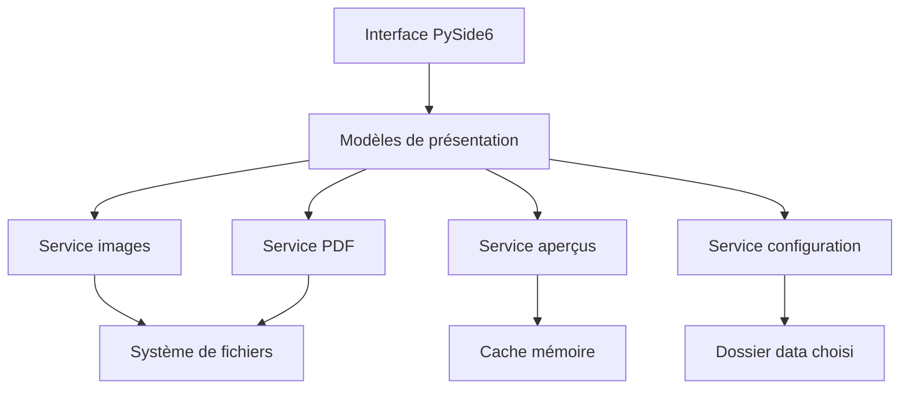

# SBBN Toolbox — Architecture et roadmap Codex

## 1. Objectif

Créer une application Windows locale, portable et sans installation permettant de :

1. convertir une ou plusieurs images JPG, JPEG, PNG ou BMP en PDF ;
2. fusionner plusieurs PDF ;
3. choisir une réorganisation des PDF entiers ou de leurs pages avant fusion ;
4. enregistrer directement le résultat à l'emplacement choisi ;
5. ne conserver aucune copie des documents traités.

Le livrable utilisateur est une archive `SBBN-Toolbox-Windows-x64.zip`. Après décompression, l'application doit fonctionner sans Python installé et sans droits administrateur.

## 2. Périmètre de la version 1

### Inclus

- Application Windows x64 portable.
- Interface en français.
- Ajout de fichiers par sélecteur et glisser-déposer.
- Conversion de plusieurs images en un PDF multipage.
- Réorganisation des images avant conversion.
- Rotation et retrait d'une image de la sélection.
- Import de plusieurs PDF.
- Choix entre un mode de réorganisation `Par document` et `Par page`.
- En mode `Par document`, chaque PDF reste un bloc indivisible : sa première page sert
  de vignette, son nombre de pages est affiché et ses pages conservent leur ordre original.
- Affichage de chaque page sous forme de vignette.
- Réorganisation globale des pages par glisser-déposer, indépendamment du fichier source.
- Rotation et retrait d'une page de la fusion.
- Choix du nom et de l'emplacement du fichier final.
- Choix d'un dossier de données personnalisable.
- Nettoyage des ressources de travail après réussite, annulation, erreur ou fermeture.

### Hors périmètre initial

- Compression avancée des PDF.
- OCR.
- Découpage autonome d'un PDF.
- Chiffrement, signature et mots de passe.
- Modification du contenu textuel d'un PDF.
- Mise à jour automatique.
- Version macOS ou Linux.
- Historique des documents traités.
- Télémétrie ou connexion Internet.

## 3. Choix techniques

| Besoin | Technologie | Responsabilité |
| --- | --- | --- |
| Langage | Python 3.12 | Logique applicative |
| Interface | PySide6 | Fenêtres, composants, drag and drop, thèmes |
| Lecture et vignettes PDF | PyMuPDF | Ouverture des PDF et rendu des aperçus |
| Fusion/rotation PDF | pypdf | Construction du PDF final |
| Images vers PDF | img2pdf | Intégration sans réencodage des JPEG compatibles |
| Traitement BMP/PNG/rotation | Pillow | Normalisation lorsque nécessaire |
| Tests | pytest + pytest-qt | Tests métier et interface |
| Qualité | Ruff | Lint et formatage |
| Typage | mypy | Vérification statique ciblée |
| Packaging | PyInstaller en mode `onedir` | Dossier Windows autonome |

Règle : les bibliothèques de traitement ne doivent jamais dépendre directement de l'interface. Les services métier doivent être testables séparément.

## 4. Architecture fonctionnelle



### Couches

- `ui` : widgets, fenêtres, dialogues et styles. Aucune manipulation PDF directe.
- `viewmodels` : état des écrans, commandes et coordination des tâches.
- `domain` : objets représentant une image importée, une page PDF et un travail en cours.
- `services` : conversion, fusion, aperçus, configuration et nettoyage.
- `infrastructure` : accès aux fichiers, chemins portables et journalisation technique.

## 5. Arborescence du dépôt

```text
sbbn-toolbox/
├── README.md
├── AGENTS.md
├── pyproject.toml
├── requirements.lock
├── .gitignore
├── assets/
│   ├── icons/
│   ├── logo/
│   └── fonts/
├── src/
│   └── sbbn_toolbox/
│       ├── __init__.py
│       ├── __main__.py
│       ├── app.py
│       ├── constants.py
│       ├── domain/
│       │   ├── image_item.py
│       │   ├── pdf_page_item.py
│       │   └── operation_result.py
│       ├── services/
│       │   ├── config_service.py
│       │   ├── image_to_pdf_service.py
│       │   ├── pdf_merge_service.py
│       │   ├── preview_service.py
│       │   ├── cleanup_service.py
│       │   └── validation_service.py
│       ├── infrastructure/
│       │   ├── paths.py
│       │   ├── atomic_writer.py
│       │   └── logging_setup.py
│       ├── viewmodels/
│       │   ├── image_converter_vm.py
│       │   ├── pdf_merger_vm.py
│       │   └── settings_vm.py
│       └── ui/
│           ├── main_window.py
│           ├── pages/
│           │   ├── home_page.py
│           │   ├── image_converter_page.py
│           │   ├── pdf_merger_page.py
│           │   └── settings_page.py
│           ├── widgets/
│           │   ├── drop_zone.py
│           │   ├── sortable_thumbnail_grid.py
│           │   ├── thumbnail_card.py
│           │   ├── empty_state.py
│           │   └── toast.py
│           └── theme/
│               ├── tokens.py
│               └── stylesheet.qss
├── tests/
│   ├── unit/
│   ├── integration/
│   ├── ui/
│   └── fixtures/
├── scripts/
│   ├── build_windows.ps1
│   ├── package_zip.ps1
│   └── smoke_test.ps1
└── packaging/
    ├── README.txt
    ├── generate_windows_version_info.py
    ├── pyinstaller_resources.json
    ├── requirements-windows.lock
    ├── version_info.json
    └── windows_entrypoint.py
```

## 6. Distribution portable et données

### Contenu du ZIP

```text
SBBN-Toolbox/
├── SBBN-Toolbox.exe
├── runtime/
├── config.json
└── README.txt
```

`config.json` est le seul fichier persistant nécessaire à côté du programme. Il ne contient aucun document ni historique, uniquement le chemin du dossier de données :

```json
{
  "schemaVersion": 1,
  "dataPath": "D:\\SBBN\\ToolboxData"
}
```

### Dossier de données

```text
ToolboxData/
├── settings.json
└── logs/
    └── sbbn-toolbox.log
```

`settings.json` contient uniquement des préférences : dernier dossier d'ouverture, dernier dossier d'enregistrement, format de page et options d'interface. Aucun nom de document traité ne doit être conservé dans un historique.

### Premier lancement

1. Lire `config.json` à côté de l'exécutable.
2. S'il est absent, proposer :
   - `data` à côté du programme ;
   - un autre dossier choisi par l'utilisateur.
3. Vérifier que le dossier est accessible en écriture.
4. Écrire le fichier de configuration de manière atomique.
5. En cas de chemin devenu inaccessible, afficher un dialogue permettant de sélectionner un nouvel emplacement.

### Modification de l'emplacement

L'écran Paramètres permet de choisir un nouveau dossier et offre deux actions explicites :

- `Utiliser le nouvel emplacement` : nouvelles préférences par défaut ;
- `Déplacer les paramètres actuels` : copie contrôlée de `settings.json`, puis changement du chemin uniquement après succès.

Le déplacement ne concerne jamais les PDF ou images de l'utilisateur.

## 7. Gestion sûre des fichiers

### Règles obligatoires

- Ne jamais modifier les fichiers sources.
- Ne jamais écrire le résultat dans un fichier source.
- Demander confirmation avant d'écraser un résultat existant.
- Écrire le résultat dans un fichier partiel situé dans le dossier de destination, puis effectuer un renommage atomique après succès.
- Supprimer le fichier partiel après erreur ou annulation.
- Ne pas copier le PDF final dans `data` ou dans le dossier du programme.
- Ne pas conserver de liste des documents récemment traités.
- Fermer explicitement tous les fichiers ouverts avant le nettoyage.

Le fichier partiel peut suivre le modèle :

```text
.<nom-final>.sbbn-partial-<identifiant>.pdf
```

Il est supprimé immédiatement en cas d'échec. Une recherche limitée aux fichiers `.sbbn-partial-*` créés par SBBN Toolbox est effectuée au prochain démarrage dans les seuls dossiers de destination connus. Aucun nettoyage récursif ou générique de `%TEMP%` n'est autorisé.

### Aperçus

- Générer les vignettes dans des `QImage` en mémoire.
- Utiliser un cache mémoire borné par taille.
- Libérer le cache quand une sélection est vidée, qu'une opération se termine ou que l'application se ferme.
- Si un très gros document impose un cache disque, utiliser un répertoire de session portant un nom strictement contrôlé et le supprimer dans un bloc `finally`. Cette possibilité n'est pas activée dans le MVP.

### Arrêt et annulation

Chaque traitement long doit :

- s'exécuter hors du thread de l'interface ;
- exposer une progression ;
- accepter une demande d'annulation entre deux pages ;
- laisser l'interface réactive ;
- fermer ses ressources et supprimer son fichier partiel dans un `finally`.

## 8. Modèle métier

### `ImageItem`

- `source_path: Path`
- `display_name: str`
- `rotation: int` avec valeurs 0, 90, 180 ou 270
- `width: int`
- `height: int`
- `format: str`
- identifiant stable pour le drag and drop

### `PdfPageItem`

- `source_path: Path`
- `source_page_index: int` indexé à partir de zéro
- `display_page_number: int` indexé à partir de un
- `source_display_name: str`
- `rotation: int`
- identifiant stable pour le drag and drop

L'ordre du tableau de `PdfPageItem` constitue l'ordre exact du PDF final. Un déplacement dans l'interface doit modifier ce tableau, sans copier immédiatement les pages.

## 9. Parcours utilisateur

### Accueil

- Logo SBBN Toolbox.
- Deux cartes principales : `Images vers PDF` et `Fusionner des PDF`.
- Accès discret aux paramètres.

### Images vers PDF

1. Ajouter ou déposer les images.
2. Afficher les vignettes.
3. Réordonner, tourner ou retirer les éléments.
4. Choisir `Taille originale` ou `A4` et les marges.
5. Cliquer sur `Créer le PDF`.
6. Choisir le nom et l'emplacement via le dialogue Windows.
7. Afficher la progression puis un message de réussite avec `Ouvrir le dossier`.

### Fusionner des PDF

1. Ajouter ou déposer plusieurs PDF.
2. Charger leurs pages progressivement.
3. Choisir le mode `Par document` ou `Par page`.
4. En mode `Par document`, afficher une carte par PDF avec la vignette de sa première
   page et réordonner les PDF comme des blocs indivisibles.
5. En mode `Par page`, afficher une grille unique avec le fichier source et le numéro
   d'origine, puis réorganiser, tourner ou retirer librement les pages.
6. Lors d'un passage vers le mode `Par document`, demander confirmation si ce changement
   doit regrouper des pages déjà entremêlées et restaurer leur ordre original par source.
7. Cliquer sur `Fusionner les PDF`.
8. Choisir le fichier final.
9. Afficher la progression puis un message de réussite.

## 10. Design system SBBN

### Tokens

| Token | Valeur | Usage |
| --- | --- | --- |
| `color-primary` | `#361C3E` | Navigation, boutons primaires |
| `color-primary-hover` | `#4B2754` | Survol et état actif |
| `color-primary-light` | `#EDE3F0` | Sélections et accents clairs |
| `color-background` | `#FFFEF9` | Fond principal |
| `color-surface` | `#F6F4F7` | Cartes et panneaux |
| `color-border` | `#E6E2E9` | Bordures |
| `color-text` | `#1B1420` | Texte principal |
| `color-text-secondary` | `#5C5563` | Texte secondaire |
| `color-success` | `#277A50` | Confirmation |
| `color-error` | `#B3261E` | Erreur |

### Principes

- Remplacer l'ancien jaune par du blanc ou blanc cassé.
- Interface simple, moderne, professionnelle et lisible.
- Pas de dégradés, glassmorphism ni ombres lourdes.
- Boutons primaires violets avec texte blanc cassé.
- Boutons secondaires clairs avec bordure violette.
- Rayon cohérent de 8 à 12 px.
- États de focus visibles et navigation clavier complète.
- Une icône ne doit pas être le seul indicateur d'une action destructive.
- Les cartes de pages doivent rester lisibles à 100 %, 125 % et 150 % de mise à l'échelle Windows.

## 11. Gestion des erreurs

Messages attendus, en français et orientés action :

- fichier inaccessible ou déplacé ;
- format d'image non valide malgré son extension ;
- PDF corrompu ;
- PDF protégé par mot de passe non pris en charge dans le MVP ;
- absence de permission d'écriture ;
- espace disque insuffisant ;
- fichier final déjà existant ;
- dossier de données inaccessible ;
- annulation utilisateur.

Les erreurs techniques détaillées vont dans le journal. L'interface affiche un message court sans trace Python.

## 12. Tests et critères de qualité

### Tests unitaires

- Validation des extensions et signatures de fichiers.
- Rotation normalisée.
- Ordre des pages conservé.
- Génération d'un PDF à partir de chaque format accepté.
- Fusion de pages provenant de plusieurs sources.
- Chargement et écriture de la configuration.
- Écriture atomique et suppression du fichier partiel.

### Tests d'intégration

- Images JPG + PNG + BMP vers un PDF lisible.
- Fusion en mode document avec inversion de l'ordre de plusieurs PDF.
- Fusion de trois PDF avec réorganisation inter-fichiers.
- Rotation d'une page dans le résultat.
- Annulation d'une opération et absence de résidu.
- Erreur provoquée et absence de résidu.
- Changement de dossier data, avec et sans migration des préférences.

### Tests interface

- Ajout par bouton et drag and drop.
- Sélection des modes `Par document` et `Par page`.
- Réorganisation de PDF entiers sans modifier l'ordre interne de leurs pages.
- Réorganisation des vignettes.
- Navigation clavier.
- Désactivation des actions lorsqu'aucun fichier n'est présent.
- Progression et annulation.
- Affichage correct avec mise à l'échelle Windows à 125 % et 150 %.

### Critères de livraison

- Le ZIP fonctionne sur un Windows 10/11 x64 propre sans Python installé.
- Aucun droit administrateur n'est demandé.
- Aucun accès réseau n'est effectué.
- Les sources ne sont jamais modifiées.
- Aucun document utilisateur ne subsiste dans le dossier du programme, le dossier data ou `%TEMP%` après une opération terminée.
- Un PDF fusionné conserve exactement l'ordre affiché.
- L'application reste réactive lors du chargement d'un gros PDF.

## 13. Roadmap Codex

Chaque phase doit se terminer par des tests exécutés et un commit local distinct. Codex ne doit pas commencer une phase si les critères de sortie de la précédente échouent.

### Phase 0 — Initialisation du dépôt

**Objectif :** disposer d'un squelette exécutable et contrôlable.

- Créer l'arborescence du dépôt.
- Ajouter `pyproject.toml`, dépendances et configuration Ruff/pytest/mypy.
- Ajouter `AGENTS.md` avec les règles de sécurité des fichiers.
- Créer une fenêtre PySide6 minimale.
- Ajouter les commandes de lancement et de test.

**Sortie :** `python -m sbbn_toolbox` ouvre une fenêtre ; lint et tests passent.

### Phase 1 — Design system et navigation

**Objectif :** obtenir la structure visuelle définitive sans logique PDF.

- Implémenter les tokens SBBN et la feuille QSS.
- Créer la fenêtre principale et les pages Accueil, Images, Fusion et Paramètres.
- Créer les composants réutilisables : boutons, cartes, zone de dépôt, état vide et toast.
- Ajouter l'accessibilité clavier et les états focus/hover/disabled.

**Sortie :** navigation fonctionnelle, cohérente à 100 %, 125 % et 150 %.

### Phase 2 — Configuration portable et dossier data

**Objectif :** rendre l'application réellement portable.

- Détecter le répertoire de l'exécutable en développement et en version compilée.
- Lire et écrire `config.json` atomiquement.
- Créer le parcours de premier lancement.
- Ajouter la modification du dossier data.
- Ajouter la migration facultative de `settings.json`.
- Gérer un chemin inaccessible ou en lecture seule.

**Sortie :** les préférences survivent au redémarrage et peuvent être déplacées sans perte.

### Phase 3 — Conversion images vers PDF

**Objectif :** livrer la première fonctionnalité complète.

- Import JPG/JPEG/PNG/BMP.
- Validation réelle du contenu.
- Génération des vignettes.
- Réorganisation, rotation et suppression.
- Options Taille originale/A4 et marges.
- Conversion en tâche de fond.
- Enregistrement atomique et progression.
- Tests d'annulation et de nettoyage.

**Sortie :** un PDF multipage correct est produit dans l'ordre affiché, sans fichier résiduel.

### Phase 4 — Fusion et réorganisation des pages PDF

**Objectif :** livrer la fonctionnalité principale de fusion.

- Import de plusieurs PDF.
- Extraction progressive des métadonnées de pages.
- Rendu asynchrone et paresseux des vignettes.
- Sélecteur de mode `Par document` / `Par page`.
- Vue par document avec la première page en vignette, le nombre de pages et une
  réorganisation des PDF sous forme de blocs indivisibles.
- Grille globale réordonnable par drag and drop.
- Rotation et retrait de pages.
- Fusion selon l'ordre du modèle actif : ordre des documents avec ordre interne original,
  ou ordre global des pages.
- Gestion des PDF corrompus et protégés.
- Tests des deux modes, du changement de mode et des documents volumineux.

**Sortie :** le résultat correspond exactement à l'ordre visible des documents ou des
pages, selon le mode sélectionné, ainsi qu'aux rotations visibles.

### Phase 5 — Robustesse et finition UX

**Objectif :** rendre l'application confortable en usage quotidien.

- Barre de progression et annulation fiable.
- Messages d'erreur finalisés.
- Raccourcis clavier utiles : ajouter, supprimer, enregistrer et tout sélectionner.
- Confirmation avant perte d'une sélection non exportée.
- Cache mémoire borné et chargement paresseux.
- Journalisation sans noms de documents dans les messages ordinaires.
- Tests sur chemins longs, caractères accentués et fichiers volumineux.

**Sortie :** tous les tests unitaires, d'intégration et UI passent.

### Phase 6 — Packaging Windows portable

**Objectif :** produire le ZIP final.

- Construire avec PyInstaller en mode `onedir` et `windowed`.
- Inclure uniquement les plugins Qt nécessaires.
- Ajouter icône, version et informations d'exécutable.
- Générer `README.txt` utilisateur.
- Exécuter le smoke test sur le dossier compilé.
- Produire `SBBN-Toolbox-Windows-x64.zip` avec checksum SHA-256.

**Sortie :** le ZIP démarre sur une machine Windows propre, sans installation et sans accès réseau.

### Phase 7 — Recette personnelle

**Objectif :** valider le comportement réel avant version 1.0.

- Tester sur un échantillon de documents non sensibles puis réels.
- Vérifier l'ordre, la rotation et la qualité visuelle.
- Vérifier manuellement l'absence de résidus.
- Corriger uniquement les anomalies bloquantes ou gênantes.
- Taguer `v1.0.0` après validation.

## 14. Roadmap de la version 1.1.0 — Système de mise à jour portable

La version 1.1.0 ajoute un système de mise à jour portable. Chaque phase doit rester
bornée à son objectif et respecter les garanties de sécurité des fichiers définies dans
ce document.

### Règles générales de mise à jour

- Le dépôt public utilisé pour les mises à jour est `Brandysve/sbbn_toolbox`.
- Aucun token GitHub ne doit être intégré à l'application.
- Seules les releases stables sont proposées automatiquement.
- Chaque ZIP contient une version complète de l'application, jamais un patch différentiel.
- Une ancienne version doit pouvoir passer directement à la dernière version stable.
- Aucune mise à jour ne peut écraser les données personnelles.
- Les mises à jour ne doivent pas nécessiter de droits administrateur.
- Les prereleases sont réservées aux tests manuels.
- L'application doit rester utilisable lorsque GitHub est indisponible.

### Phase 8.1 — Versionnement et détection

**Objectifs :**

- Utiliser `pyproject.toml` comme source unique de version.
- Afficher la version installée dans Paramètres.
- Vérifier la dernière release stable du dépôt public `Brandysve/sbbn_toolbox`.
- Comparer les versions selon SemVer.
- Effectuer la vérification automatique au maximum une fois toutes les 24 heures.
- Permettre une vérification manuelle.
- Gérer silencieusement les erreurs réseau.
- Identifier les assets ZIP et SHA-256 attendus.
- Ne télécharger ni installer encore aucune mise à jour.

**Critère de sortie :** l'application indique correctement si une version stable plus
récente est disponible.

### Phase 8.2 — Téléchargement sécurisé

**Objectifs :**

- Télécharger le ZIP et son SHA-256.
- Afficher la progression et permettre l'annulation.
- Vérifier le hash avant extraction.
- Refuser une archive ou un hash invalide.
- Valider strictement la structure du ZIP.
- Protéger contre les chemins d'extraction sortant du dossier autorisé.
- Nettoyer les téléchargements après erreur ou annulation.
- Accepter temporairement le `config.json` des ZIP 1.0.0 pour compatibilité, sans
  l'extraire ni préparer son écrasement. Son remplacement par `config.default.json`
  reste prévu pour la Phase 8.4.
- Ne pas encore remplacer l'application active.

**Critère de sortie :** une mise à jour valide peut être téléchargée et préparée sans
modifier l'installation actuelle.

### Phase 8.3 — Updater portable et rollback

**Objectifs :**

- Créer un updater séparé.
- Fermer SBBN Toolbox avant remplacement.
- Sauvegarder temporairement la version actuelle.
- Remplacer uniquement les fichiers du programme.
- Préserver impérativement `config.json` et le dossier `data` externe.
- Redémarrer l'application après mise à jour.
- Confirmer le premier démarrage réussi.
- Restaurer automatiquement l'ancienne version en cas d'échec.
- Nettoyer la sauvegarde après validation.

**Critère de sortie :** la mise à jour et le retour arrière fonctionnent sans installation
ni droits administrateur.

### Phase 8.4 — Packaging et publication

**Objectifs :**

- Intégrer l'updater au build PyInstaller portable.
- Livrer `config.default.json` sans écraser un `config.json` existant.
- Contrôler la cohérence entre la version applicative, les métadonnées Windows, le tag Git
  et la release.
- Adapter les scripts PowerShell.
- Produire le ZIP et son SHA-256.
- Documenter la procédure de publication GitHub Releases.
- Conserver les noms stables :
  - `SBBN-Toolbox-Windows-x64.zip` ;
  - `SBBN-Toolbox-Windows-x64.zip.sha256`.

**Critère de sortie :** le ZIP 1.1.0 contient l'updater et peut être publié comme asset
GitHub.

### Phase 8.5 — Recette et publication 1.1.0

**Objectifs :**

- Tester une mise à jour réelle entre deux versions.
- Tester l'absence de connexion.
- Tester un hash erroné.
- Tester une interruption.
- Tester le rollback.
- Vérifier la conservation des paramètres et données.
- Publier la release stable `v1.1.0`.

**Critère de sortie :** un PC équipé de SBBN Toolbox peut recevoir automatiquement une
version ultérieure sans ZIP manuel.

## 15. Ordre conseillé des demandes à Codex

Utiliser des demandes courtes et bornées :

1. `Initialise le dépôt selon la Phase 0 du document. Exécute les tests et arrête-toi.`
2. `Implémente uniquement la Phase 1. Ne commence pas la configuration ni le traitement PDF.`
3. `Implémente la Phase 2 et couvre les chemins en lecture seule par des tests.`
4. `Implémente la Phase 3. Vérifie qu'aucun fichier partiel ne subsiste après erreur ou annulation.`
5. `Implémente la Phase 4 avec rendu paresseux des vignettes et réorganisation page par page.`
6. `Réalise la Phase 5 et fournis le résultat complet des tests.`
7. `Réalise la Phase 6 et produis le ZIP Windows x64 avec son checksum.`
8. `Réalise uniquement la Phase 8.1 et arrête-toi après les tests et le commit.`
9. `Réalise uniquement la Phase 8.2 sans remplacer l'application active.`
10. `Réalise uniquement la Phase 8.3 et valide le rollback.`
11. `Réalise uniquement la Phase 8.4 et documente la publication.`
12. `Réalise la Phase 8.5 et publie la release stable v1.1.0.`

Ne pas demander à Codex de réaliser toutes les phases en une seule fois. Chaque phase doit être vérifiée dans l'application avant de poursuivre.

## 16. Règles à placer dans `AGENTS.md`

```markdown
# SBBN Toolbox — règles de contribution

- Respecter l'architecture `ui -> viewmodels -> services`.
- Ne jamais mettre de manipulation PDF directement dans les widgets.
- Ne jamais modifier un fichier source utilisateur.
- Ne jamais conserver un document traité dans `data`, le dossier du programme ou `%TEMP%`.
- Toute écriture de résultat doit être atomique et nettoyée dans un bloc `finally`.
- Ne jamais utiliser de suppression récursive sur un chemin non résolu et non validé.
- Limiter le nettoyage aux fichiers ou dossiers créés par l'opération courante.
- Tout traitement de plusieurs pages doit être annulable et exécuté hors du thread UI.
- Ajouter ou adapter les tests avec chaque modification métier.
- Exécuter Ruff et pytest avant de déclarer une phase terminée.
- Conserver les textes d'interface en français dans un module centralisé.
- Utiliser uniquement les tokens du design system SBBN pour les couleurs et espacements.
- Ne pas ajouter de télémétrie. Limiter l'accès réseau au service de mise à jour public,
  sans token GitHub ni envoi de données personnelles.
- Ne pas élargir le périmètre d'une phase sans demande explicite.
```

## 17. Définition de terminé — version 1.0

La version 1.0 est terminée lorsque :

- la conversion JPG/JPEG/PNG/BMP fonctionne ;
- plusieurs images peuvent former un PDF multipage réordonné ;
- plusieurs PDF peuvent être combinés page par page dans n'importe quel ordre ;
- les rotations demandées sont appliquées ;
- le dossier data est personnalisable ;
- le résultat est écrit uniquement à l'emplacement choisi ;
- tous les fichiers de travail sont supprimés ;
- le ZIP fonctionne sans installation sur Windows 10/11 x64 ;
- les tests automatisés passent ;
- la recette manuelle est validée.
